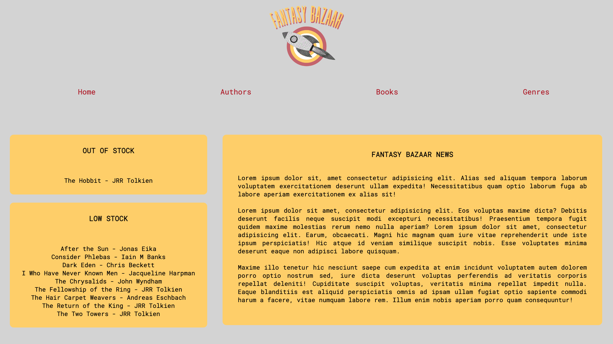

# Fantasy Bazaar

## The Brief

My first project at CodeClan, undertaken in week 6 after having studied Python for 5 weeks. The brief was to create an inventory application for a bookshop which allows the shop owner to create and edit books/authors, track individual books/authors, and clearly display low stock and out of stock items.

I was inspired by the comic-book shop in the TV program Spaced, The Fantasy Bazaar, and because of that my bookshop specialises in fantasy and science fiction works. I was able to use my own experience of working in independent shops to better understand what my client would find beneficial. 

**Timescale - 6 days**

## Getting Started

Install flask & psycopg: 
`pip3 install Flask` 
`pip3 install psycopg2` 

Create & seed the database: 
`createdb bookshop` 
`psql -d bookshop -f` 

Run the app: 
`flask run`

View the web application in the browswer by navigating to: 
http://localhost:4999

## Tech Used
- Python
- Flask 
- PostgreSQL
